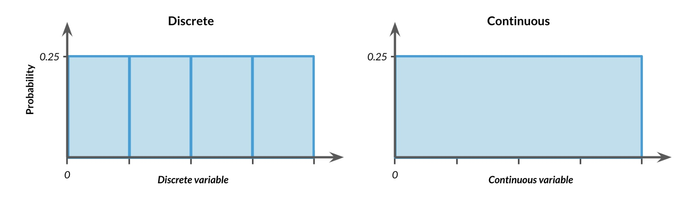

> # Probability

Probability is the measure of how likely an event is to occur, expressed as a number between 0 (impossible) and 1 (certain).
 
Probability of an event (0% - 50% - 100%) chance

`P(event) = # ways an event can happen / total # of possible outcomes`

> ### Sampling Methods

Sampling is the process of selecting a subset of data from a larger population to analyze and make inferences about the whole.

Example: Surveying 100 people from a city of 1 million to estimate public opinion.

**Types of Sampling:**

1. With Replacement
   - Selected items can be chosen multiple times.
   - Used when population is infinite or repetition is allowed.
 - Example: Drawing **random lottery numbers** with replacement.
```python
np.sample(replace = True)
```

2. Without Replacement
   - Selected items cannot be chosen again.
   - Ensures uniqueness in the sample.
- Example: Selecting **raffle winners** without putting names back.

`np.random.seed(10)`
- Sets the **random seed** to ensure reproducibility.
- Ensures that random numbers generated remain the same across runs.

`np.random.sample()`
- Generates random numbers between `0` and `1`.
- Returns values from a **uniform distribution**.

> ### Events

**Independent Events**: Two events are independent if the probability of the second event isn't affected by the outcome of the first event. 

**Dependent Events:** Two events are dependent if the probability of the second event is affected by the outcome of the first event.

> ### Law of Large Numbers
The **Law of Large Numbers (LLN)** is a fundamental concept in probability and statistics. It states that as the size of a sample increases, the sample mean (average) of a random variable will get closer and closer to the expected value (population mean) of that random variable.

In simpler terms, the more times you repeat an experiment or observation, the more the average of your results will converge to the true average or expected value.

There are two forms of the law:

- **Weak Law of Large Numbers (WLLN):** As the sample size increases, the probability that the sample mean will be close to the expected value increases. This doesn't guarantee that the sample mean will always equal the population mean, but it makes it increasingly likely as the sample size grows.

- **Strong Law of Large Numbers (SLLN):** This version guarantees that, almost surely, the sample mean will eventually equal the expected value as the sample size becomes infinite. Essentially, given enough trials, the sample mean will always converge to the true mean.


# Probability Distributions

## **Uniform Distribution**
A **Uniform Distribution** is a type of probability distribution where all outcomes are equally likely.  
Imagine rolling a fair die—each number (1 to 6) has an equal chance of appearing. That’s uniform probability!  

There are **two types** of uniform distributions:



---

## **1. Discrete Uniform Distribution**
When there are **a fixed number of possible outcomes**, and each has an equal probability.

📌 **Formula**:  
If there are $n$ outcomes, the probability of each outcome is:

$$
P(X = x) = \frac{1}{n}, \quad \text{for } x \in \{x_1, x_2, ..., x_n\}
$$


📌 **Example**:  
- **Rolling a fair 6-sided die** 🎲  
  Each number (1, 2, 3, 4, 5, 6) has a **1/6** probability.
- **Choosing a random card from a deck** 🃏  
  Probability of drawing any specific card (e.g., Ace of Spades) is **1/52**.

---

## **2. Continuous Uniform Distribution**
When the possible values are **continuous** (within a range), and any number in that range is equally likely.

📌 **Formula**:  
For a uniform distribution between $a$ and $b$, the probability density function (PDF) is:

$$
f(x) = \frac{1}{b-a}, \quad \text{for } a \leq x \leq b
$$

The area under the curve is always **1**.


📌 **Example**:
- **Randomly picking a number between 0 and 1**  
  Any number (e.g., 0.25, 0.789, 0.999) is equally likely, with a probability density of **1**.
- **Arrival time of a bus between 10:00 and 10:30 AM**  
  If a bus arrives at a **random time** between 10:00 and 10:30, any second in this interval is equally probable.

---

## **Key Differences**
| Type | Possible Values | Example |
|------|---------------|---------|
| **Discrete Uniform** | Finite set (whole numbers) | Rolling a die 🎲 |
| **Continuous Uniform** | Infinite values in a range | Random time between 10:00-10:30 🕙 |

## **Methods of `scipy.stats.uniform`**

| Method | Description | Formula / Explanation | Example |
|--------|-------------|------------------------|---------|
| `uniform.rvs(loc, scale, size)` | Generates random numbers from a uniform distribution. | Returns `n` random values in the range `[a, b]`. | `uniform.rvs(loc=2, scale=8, size=5)` → Generates 5 random numbers between **2 and 10**. |
| `uniform.pdf(x, loc, scale)` | Probability Density Function (PDF). | \( f(x) = \frac{1}{b-a}, \quad \text{for } a \leq x \leq b \) | `uniform.pdf(6, loc=2, scale=8)` → **0.125** (since \( 1 / (10-2) = 0.125 \)). |
| `uniform.cdf(x, loc, scale)` | Cumulative Distribution Function (CDF). | \( P(X \leq x) = \frac{x - a}{b - a} \) | `uniform.cdf(6, loc=2, scale=8)` → **0.5** (50% chance a number ≤ 6). |
| `uniform.ppf(q, loc, scale)` | Percent-Point Function (Inverse CDF). | Finds `x` such that \( P(X \leq x) = q \). | `uniform.ppf(0.5, loc=2, scale=8)` → **6** (median of the range). |
| `uniform.moment(n, loc, scale)` | Returns the `n`th moment about the mean. | Formula depends on the moment order. | `uniform.moment(1, loc=2, scale=8)` → First moment (expected value). |
| `uniform.stats(loc, scale, moments='mvsk')` | Returns mean, variance, skewness, and kurtosis. | - **Mean**: \( \frac{a + b}{2} \)  - **Variance**: \( \frac{(b-a)^2}{12} \) | `uniform.stats(loc=2, scale=8, moments='mv')` → (Mean=6, Variance=5.33). |
| `uniform.entropy(loc, scale)` | Computes the entropy (randomness) of the distribution. | \( \ln(b-a) \) | `uniform.entropy(loc=2, scale=8)` → **2.08**. |
| `uniform.median(loc, scale)` | Returns the median value. | \( \frac{a + b}{2} \) | `uniform.median(loc=2, scale=8)` → **6**. |
| `uniform.fit(data)` | Estimates `loc` and `scale` from given data. | Fits the distribution parameters to data. | `uniform.fit([2, 4, 6, 8, 10])` → Estimates parameters from data. |

---

### **Key Takeaways**
- `rvs()` → **Generates** random values.
- `pdf()` → **Density** function (flat for uniform).
- `cdf()` → **Cumulative probability**.
- `ppf()` → **Inverse CDF** (finds value from probability).
- `stats()` → **Mean & Variance**.
- `entropy()` → **Measures randomness**.

📌 **Reference:** Official SciPy documentation - [Scipy Uniform Distribution](https://docs.scipy.org/doc/scipy/reference/generated/scipy.stats.uniform.html)


## Binomial Distribution

## Normal Distribution

## The Central Limit Theorem

## The Poisson Distribution
**Poisson process**: A **Poisson process** describes a situation where events occur at a consistent average rate, but the actual timing of each event is random. For instance, consider the number of animals adopted from a shelter each week. While we might expect an average of 8 adoptions per week, the actual number can vary unpredictably from one week to the next.

**Poisson distribution**: The **Poisson distribution** models the likelihood of a certain number of events occurring within a fixed time interval. It can be used to estimate probabilities like at least 5 animals being adopted in a week, 12 people arriving at a restaurant in an hour, or fewer than 20 earthquakes happening in California over a year.

The Poisson distribution is defined by **λ (lambda)**, the average number of events in a time period.

To use it in Python:
```python
from scipy.stats import poisson

# Probability of exactly 5 adoptions
poisson.pmf(5, mu=8)

# Probability of 5 or fewer adoptions
poisson.cdf(5, mu=8)
```

## Exponential Distribution
The exponential distribution helps us find the chance of a certain amount of time passing between Poisson events. For example, we can use it to find the probability that it takes more than 1 day between adoptions, less than 10 minutes between restaurant arrivals, or 6 to 8 months between earthquakes.

It uses the same lambda (rate) as the Poisson distribution, but unlike Poisson (which counts events), the exponential distribution deals with time—so it's continuous, not discrete.

To use it in Python:
```python
# scale = 1/λ = 1/0.5 = 2
from scipy.stats import expon

# Probability of waiting < 1 minute
expon.cdf(1, scale=2)

#Prob of waiting > 4 minutes
1 - expon.cdf(4, scale=2)

#Prob of waiting 1 min < wait < 4 min
expon.cdf(4, scale=2) - expon.cdf(1, scale=2)
```
## (Students) t-distribution
- A probability distribution used when estimating the mean of a small sample from a normally distributed population.
- Looks similar to a normal distribution but has fatter tails, meaning it accounts for more variability when the sample size is small.
- Commonly used in t-tests and confidence intervals when the sample size is small and population standard deviation is unknown.

> Used when you have a small sample size and want to make inferences about the population.

- A/B Testing with Small Samples: Comparing the average click-through rates of two email versions with only 15 recipients each.

- Medical Trials: Estimating the average effect of a new drug in a study with only 10 patients.

- Classroom Scores: Comparing the test scores of two small groups of students to see if one teaching method is more effective.


## Log-normal distribution
- A distribution where the logarithm of the variable is normally distributed.
- Used to model variables that grow multiplicatively and are always positive, like income, stock prices, or reaction times.
- It’s skewed to the right, meaning most values are small, but a few are much larger.

> Used when data is positive and spreads out in a multiplicative way.

- Income Distribution: Most people earn a moderate amount, but a few earn very high salaries.

- Stock Prices: Returns are often modeled using a log-normal distribution because prices can't go below zero and grow multiplicatively.

- Time to Complete a Task: In usability studies, time to complete a task often follows a log-normal distribution — many users finish quickly, but a few take a lot longer.

- Biological Measurements: Such as lengths of organisms or reaction times that are skewed right.


