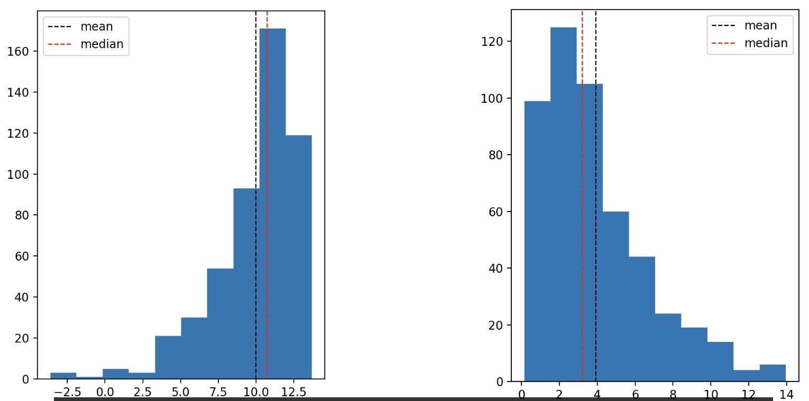
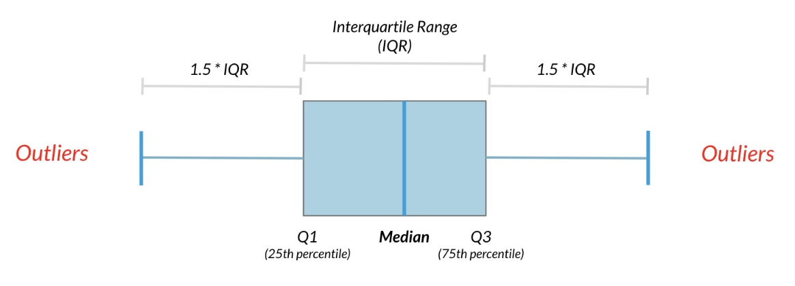

# Intro Statistics

> ## What can we do with statistics
- How likely is someone to purchase a product? 
- Are people more likely to purchase it if they can use a different payment system? 
- How many occupants will your hotel have? How can you optimize occupancy? 
- How many sizes of jeans need to be manufactured so they can fit 95% of the population? Should the same number of each size be produced? 
- A question like, Which ad is more effective in getting people to purchase a product? can be answered with A/B testing.

> ## Two main branches of Statistics

Descriptive: Descriptive statistics focuses on describing and summarizing the data at hand.

Inferential: Inferential statistics uses the data at hand, which is called sample data, to make inferences about a larger population. 

> ## Data Types

1. Quantitative [Numeric]
   - Continuous (Measured)
     - Airplace Speed
     - Time spent waiting in line
   - Discrete (Counted)
     - Number of pets
     - Number of packages shipped

2. Qualitative [Categorical]
   - Nominal (Unordered)
     - Married/Unmarried [1 or 0]
     - Country of residence [1,2,3,..]
   - Ordinal (Ordered)
     - Strongly disagree [1]
     - Somewhat disagree [2]
     - Neither agree nor disagree [3]
     - Somewhat agree [4]
     - Strongly agree [5]

Identifying data types is crucial as they determine appropriate summary statistics and visualizations. Numerical data suits metrics like the mean and scatter plots, while categorical data requires different approaches.

> ## Measures of Center

- Mean: Avg of all data points.Sum of all the data points divided by the total number of data points
- Median: Median is the middle value of the dataset where 50% of the data is less than the median, and 50% of the data is greater than the median.
- Mode: Most frequently occuring value.

`Mean` is sensitive to extreme values, and works better for symmetrical data and not `skewed` distribution in which case `median` is a better measure to use. Mean will be pulled around by the outliers and hence median is the best choice in that case.

**Left skew**: Data is piled up on the right with a tail on the left.
**Right skew**: Data is piled up on the left with a tail on the right.



> ## Measures of Spread

> ### Variance

Variance, measures the average
distance from each data point to the data's mean.

To calculate the variance, we start by calculating the distance between each point and the mean, so we get one number for every data point. We then square each distance and then add them all together. Divide the sum of squared distances by the number of data points minus 1, giving us the variance. The higher the variance, the more spread out the data is. 

In python, we can calcualte variance in 1 step using `np.var()`

```python
np.var(mssleep['sleep_total'], ddof=1)
```
- `ddof` stands for **Delta Degrees of Freedom**. It adjusts the divisor used in variance calculation.

<details>
  <summary>NumPy `ddof` in `np.var()`</summary>

#### **What is `ddof` in `np.var()`?**
- `ddof` (**Delta Degrees of Freedom**) adjusts the denominator in variance calculation.
- **Formula:**
  $$
  \text{Var}(X) = \frac{\sum (X_i - \bar{X})^2}{N - \text{ddof}}
  $$
  - \( N \) = number of elements.
  - \( \bar{X} \) = mean.
  - `ddof=0` (default) → Divides by \( N \) (population variance).
  - `ddof=1` → Divides by \( N-1 \) (sample variance, unbiased estimator).

#### **Example:**
```python
import numpy as np

data = [10, 20, 30, 40, 50]

# Population variance (default, ddof=0)
print(np.var(data))  # Output: 200.0

# Sample variance (ddof=1)
print(np.var(data, ddof=1))  # Output: 250.0
```
</details>

> ### Standard Deviation

The standard deviation (SD) is a measure of how spread out the values in a dataset are. It tells us how much the data points deviate from the mean on average

Calculated by taking the square root of the variance. In python using `np.std()`

```python
np.std(msleep['sleep_total'], ddof=1)
```

> ### Mean Absolute Deviation (MAD)
The Mean Absolute Deviation (MAD) measures the average distance between each data point and the mean. Unlike variance and standard deviation, MAD does not square the differences, making it less sensitive to outliers.

**SD vs. MAD**

- SD squares distances, penalizing longer distances more than shorter ones.
- MAD penalizes each distance equally.

> ### Quantiles

Quantiles, also called percentiles, split up the data into some number of equal parts calculated using `np.quantiles` in python.

```python
# This gives us 10.1 hours, so 50% of mammals in the dataset sleep less than 10.1 hours a day, and the other 50% sleep more than 10.1 hours.

np.quantile(msleep['sleep_total'], 0.5)

# Pass in a list of numbers to get multiple quantiles at once. 

np.quantile(msleep['sleep_total'], [0, 0.25, 0.5, 0.75, 1])


# Use `np.linspace` as a shortcut, which takes in the starting number, the stopping number, and the number intervals. 

np.quantile(msleep['sleep_total'], np.linspace(0, 1, 5))
```

> ### Interquartile Range (IQR)
The interquartile range, or IQR, is another measure of spread. It's the distance between the 25th and 75th percentile, which is also the height of the box in a boxplot. 

It can calculated using the `np.quantile()` function or the `iqr()` function from `scipy.stats`

```python
# 
np.quantile(msleep['sleep_total'], 0.75) - np.quantile(msleep['sleep_total'], 0.25)
# 
from scipy.stats import iqr
iqr(msleep['sleep_total])
```
> ### Outliers
Outliers are data points that are substantially different from the others.

To know what a substantial difference is:
- A rule that's often used is that any data point less than the first quartile minus 1.5 times the IQR is an outlier, as well as any point greater than the third quartile plus 1.5 times the IQR.



```python
import numpy as np

# Example dataset
data = np.array([10, 12, 14, 15, 18, 21, 110])

# Compute Q1, Q3, and IQR
Q1 = np.percentile(data, 25)
Q3 = np.percentile(data, 75)
IQR = Q3 - Q1

# Compute outlier thresholds
lower_bound = Q1 - 1.5 * IQR
upper_bound = Q3 + 1.5 * IQR

# Identify outliers
outliers = data[(data < lower_bound) | (data > upper_bound)]
print("Outliers:", outliers)

# Any value < 3 or > 27 is an outlier.
# 110 is an outlier because it is greater than 27.
```